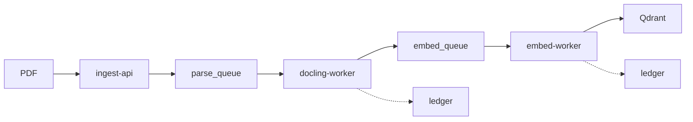

# Docling Normalization Cluster

A deterministic document processing pipeline:
**Docling → Canonical JSON → Embeddings → Vector Store**

## Quick Start

```bash
# Start all services
docker-compose up --build

# Or, if using Kubernetes (kind)
kind create cluster --config kind-cluster.yaml
kubectl apply -f k8s/
```

## Services

|Service|Port|Description|
|---|---|---|
|ingest-api|8000|Document ingestion API|
|qdrant|6333|Vector store|
|redis|6379|Message queue|

## Architecture


